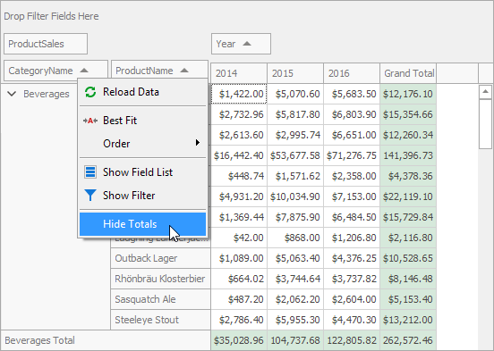

<!-- default badges list -->

<!-- default badges end -->

# Pivot Grid for WinForms - How to Customize the Popup Menu to Hide or Show Totals

This example demonstrates how to add a new item to the field header's pop-up menu. This item shows or hides totals in the PivotGrid control.

For this, handle the [PivotGridControl.PopupMenuShowing](https://docs.devexpress.com/WindowsForms/DevExpress.XtraPivotGrid.PivotGridControl.PopupMenuShowing) event. In the **PopupMenuShowing** event handler, create a new menu item and add it to the [e.Menu.Items](https://docs.devexpress.com/WindowsForms/DevExpress.Utils.Menu.DXSubMenuItem.Items) collection.

<!-- default file list -->
## Files to Look at

* [Form1.cs](./CS/Form1.cs) (VB: [Form1.vb](./VB/Form1.vb))
* [Program.cs](./CS/Program.cs) (VB: [Program.vb](./VB/Program.vb))
<!-- default file list end -->
## Documentation 
- [PivotGridControl.PopupMenuShowing](https://docs.devexpress.com/WindowsForms/DevExpress.XtraPivotGrid.PivotGridControl.PopupMenuShowing)
- [Field Header Context Menu](https://docs.devexpress.com/WindowsForms/1726/controls-and-libraries/pivot-grid/ui-elements/field-header-context-menu?p=netframework)
## More Examples
- [Pivot Grid for WinForms - How to Change SummaryDisplayType in the Context Menu](https://github.com/DevExpress-Examples/how-to-change-summarydisplaytype-via-the-context-menu-e2321)
<!-- feedback -->
## Does this example address your development requirements/objectives?

 

(you will be redirected to DevExpress.com to submit your response)
<!-- feedback end -->
